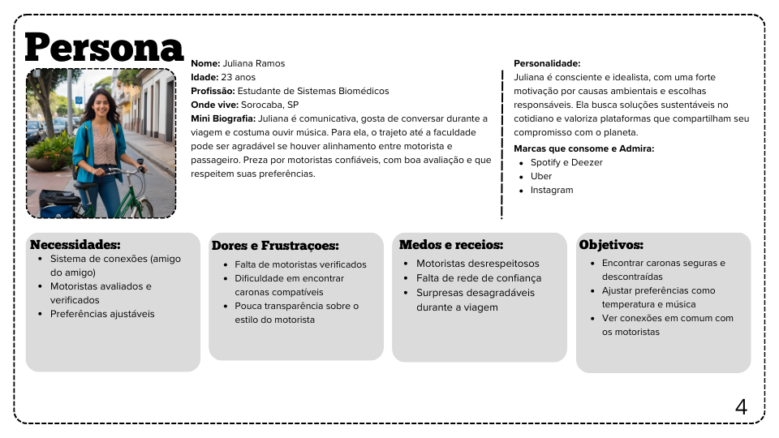

# **Personas:**

# **Users Stories:**

## Motoristas

1. **Como motorista, quero definir minhas preferências de viagem (horários, regras e número de passageiros) para garantir uma experiência confortável.**

2. **Como motorista, quero ter acesso a um chat com o passageiro para alinhar detalhes da carona antes do trajeto.**

3. **Como motorista, quero avaliar os passageiros após cada corrida para contribuir com a segurança e reputação da comunidade.**

4. **Como motorista, quero contar com um suporte da plataforma (UniRide) para resolver problemas ou cancelamentos.**

5. **Como motorista, quero ver conexões em comum (amigo do amigo) para sentir mais segurança ao aceitar um passageiro.**

6. **Como motorista, quero poder filtrar e personalizar quem pode embarcar com base em critérios de segurança e preferências.**

## Passageiros

7. **Como passageiro, quero definir minhas preferências de viagem (música, silêncio, conversa, temperatura) para garantir uma experiência confortável.**

8. **Como passageiro, quero visualizar conexões em comum com os motoristas para aumentar a sensação de segurança.**

9. **Como passageiro, quero receber notificações sobre o status da corrida (início, cancelamento, confirmação) para acompanhar em tempo real.**

10. **Como passageiro, quero avaliar os motoristas após cada carona para ajudar outros usuários a fazerem boas escolhas.**

11. **Como passageiro, quero ter a certeza de que os motoristas são verificados, com CNH válida e documentação em dia.**
