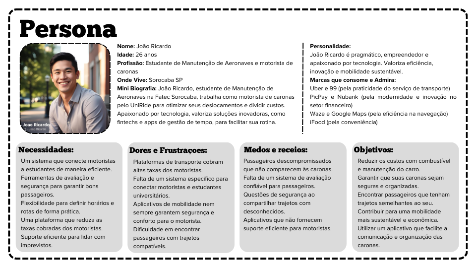
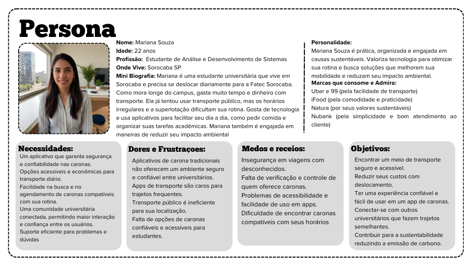

# Personas e User Stories

## Usuário Motorista - Ricardo

 

### User Story

Como João Ricardo, um estudante e motorista que busca otimizar seus deslocamentos diários e complementar sua renda, eu quero uma plataforma de caronas específica para universitários, que me permita encontrar passageiros confiáveis com trajetos semelhantes ao meu, garantindo segurança e flexibilidade para definir horários e rotas. Também preciso de um sistema de avaliações eficaz e um suporte eficiente para lidar com imprevistos, além de uma divisão justa dos valores entre motorista e aplicativo, para que eu possa reduzir meus custos com combustível e manutenção, garantir uma experiência segura e organizada nas caronas, e contribuir para uma mobilidade mais sustentável dentro do ambiente universitário.

## Usuário Passageiro - Mariana

 

### User Story

Como Mariana Souza, uma estudante universitária que precisa se deslocar diariamente para a Fatec Sorocaba, eu quero um aplicativo de caronas que seja eficiente, confortável, sustentável e mais acessível financeiramente do que Uber, 99 ou transporte público. Também desejo um ambiente seguro e confiável, com verificação de passageiros e motoristas, além de opções acessíveis para estudantes e recursos que garantam acessibilidade a todos, para que eu possa reduzir meus custos diários, ter uma forma mais prática de ir para a faculdade, evitando a superlotação e a ineficiência do transporte público na minha região, e conectar-me com outros universitários, criando uma rede confiável dentro da comunidade acadêmica.
