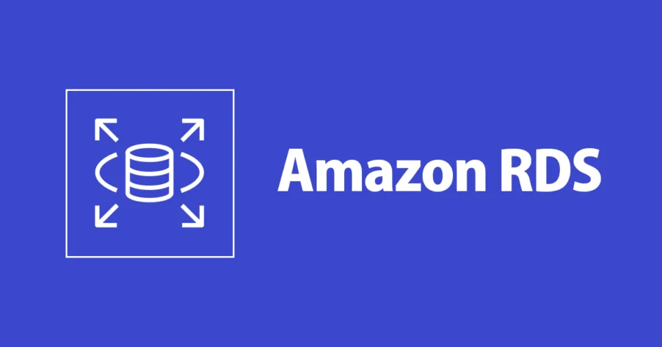

# **Requisitos Técnicos: Banco de Dados e Arquiteturas**

## **Processamento de Transações Online (OLTP):**

O projeto **UniRide** requer o uso de **OLTP (Online Transaction Processing)**, um tipo de processamento de dados que consiste na execução de um grande número de transações simultâneas. Essas transações incluem **pagamentos, reservas de corridas, envio de notificações, atualizações de status de motoristas e passageiros**, entre outras operações críticas para o funcionamento do sistema em tempo real.

### **Características do OLTP:**

1. **Alta Concorrência:** Diversos usuários podem interagir com o sistema simultaneamente, o que exige uma estrutura eficiente para lidar com múltiplas requisições ao mesmo tempo.

2. **Baixa Latência:** As transações devem ser processadas rapidamente para garantir uma experiência fluida e eficiente aos usuários.

3. **Integridade e Consistência:** O sistema deve garantir que as transações sejam seguras e confiáveis, evitando erros como pagamentos duplicados ou conflitos em reservas de corridas, como, por exemplo, **carro com mais pessoas do que lugares**.

4. **Disponibilidade:** O serviço de carona deve estar sempre disponível para os usuários, basicamente 24/7, para atender estudantes de diferentes turnos, como diurno, vespertino e noturno.

### **Funcionamento das Transações OLTP**
Esse tipo de processamento lida com **transações econômicas ou financeiras**, fundamentais para sistemas como o UniRide. As principais operações envolvem:

- **Inserção de dados:** Registro de novos usuários, formas de pagamento, criação de viagens e processamento de pagamentos.

- **Atualização de dados:** Mudanças no status da corrida, atualização da localização do motorista e ajuste de tarifas dinâmicas.

- **Exclusão de dados:** Cancelamento de corridas, exclusão de contas e cartões.

## **Banco de Dados:**

Pensando na arquitetura de um aplicativo como o UniRide, seria uma **arquitetura híbrida**, considerando que dados **estruturados (SQL)** como cadastro de usuário e motorista, histórico de corrida, pagamentos (levando em consideração transações **ACID**), já os dados **não estruturados (NoSQL)** ou seja dinâmicos, escaláveis e em tempo real como localização do motorista e notificações. 

### **Amazon RDS (Aurora):**

A ideia é utilizar serviços da AWS para que tenhamos a melhor performance do aplicativo, em quesitos como: **escalabilidade, disponibilidade e redunância, otimização de custos, segurança e conformidade, desempenho, agilidade e integração**. Uma vez que seria **mais custoso, desafiador e demorado** manter e criar um data center local para as operações. 

Portanto, a escolha de Banco de Dados Relacional ideal seria o **Amazon Aurora**, pois ele é totalmente gerenciado pela AWS, altamente disponível e otimizado, além de ser integrado com **MySQL** e **PostgreSQL**, com desempenho de até 5x mais que MySQL e PostgreSQL tradicional. 

**Benefícios:**

- **Consistência e integridade dos dados:** O RDS (Aurora) é ideal para armazenar dados críticos e estruturados, como cadastros de usuários, histórico de corridas, pagamentos e relacionamentos entre tabelas.

- **Escalabilidade Automática:** : Aurora pode ajustar automaticamente a capacidade de leitura e escrita com base na carga, oferecendo alta disponibilidade e replicação sem a necessidade de gerenciamento manual.

- **Backup e recuperação automáticos:** O Aurora faz backups automáticos e oferece recuperação em caso de falhas, garantindo alta disponibilidade e integridade dos dados.

- **Menor custo e maior desempenho:** Oferece uma solução de banco de dados relacional de alto desempenho, sem o custo de soluções tradicionais.

- **ElastiCache**

### **Amazon DynamoDB:**

O **DynamoDB** é um banco de dados NoSQL totalmente gerido e altamente escalável. Ele é uma excelente escolha para armazenar dados dinâmicos e em tempo real, como localização de motoristas, status das corridas e eventos.

**Benefícios:**

- **Escalabilidade:** O DynamoDB pode escalar automaticamente para lidar com picos de tráfego, o que é crucial para um aplicativo de transporte, onde as solicitações podem variar dependendo do horário e da demanda.

- **Desempenho em tempo real:** Ideal para armazenar dados de localização de motoristas e passageiros, onde a leitura e escrita rápidas são essenciais.

- **Baixo custo com escalabilidade automática:** Você paga apenas pelo que usa, o que permite otimizar custos de acordo com o tráfego real do seu aplicativo.

- **Baixa latência:** Ideal para operações em tempo real, como atualizar a localização de motoristas e passageiros ou gerenciar solicitações de carona.

- **DynamoDB Accelerator (DAX)**

## **Arquiteturas AWS:**