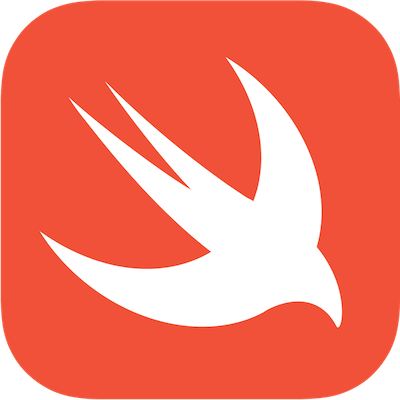
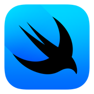
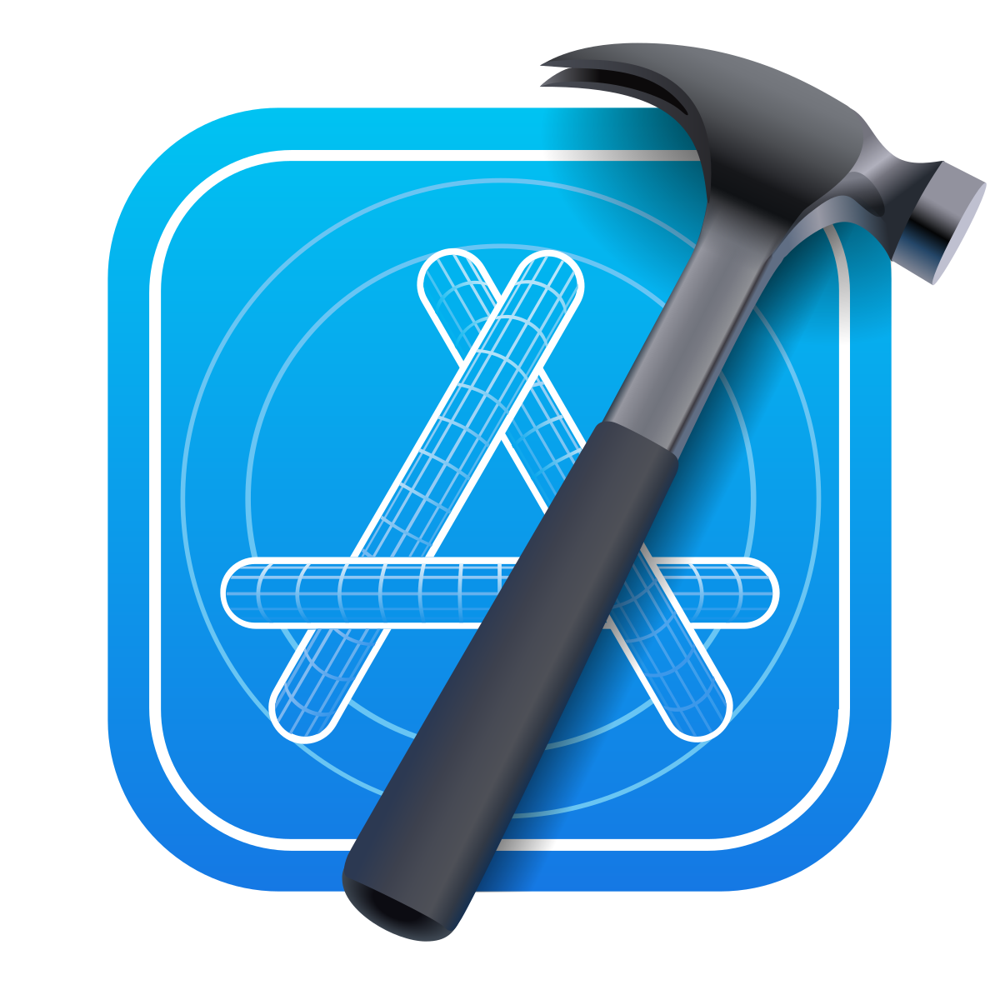

# **Tecnologias Frontend**

## Tecnologias Web
Ao desenvolvermos uma versão Web para nosso aplicativo, temos de usar as ferramentas corretas para a criação do aplicativo,  
e isso envolve a utilização de tecnologias voltadas para o frontend do desenvolvimento, como o uso das linguagens **JavaScript** e **TypeScript**,  
e o uso de frameworks como o **React.js** para estruturar o desenvolvimento do app.

---
### **JavaScript**

 

Uma das Linguagens de programação mais utilizadas no mundo, o JavaScript, ou JS, é uma linguagem de interpretação de alto nível, e junto do  HTML e CSS formam a base de toda a internet atual.

Um dos principais atrativos do JavaScript é a o destaque em deixar as paginas web mais dinamicas e aumentando a interatividade delas,  
    
como um conteúdo que possui uma animação que fica constantemente mudando.

Outros atrativos para a utilização do JavaScript são sua segurança, atualizações constantes e a Criação de novas bibliotecas, frameworks e códigos prontos.

---

### **TypeScript**

 

O TypeScript é uma linguagem voltada para auxiliar no desenvolvimento web com o JavaScript, adicionando novas funcionalidades ao JS, como escrita estática e servindo também como uma segurança adicional, visto que por causa da facilidade de programação do JavaScript, a chance de fazer algum erro no código que depois quebraria a aplicação toda era muito grande.   

O TypeScript foi desenvolvido especificamente para corrigir esses erros e ainda ser compatível com ambientes JavaScript já existentes. 

---

## Tecnologias IOs

### Swift

 

A linguagem Swift foi a escolhida para o desenvolvimento do projeto em IOS pois diferente da sua antecessora Objective-C, possui uma sintaxe clara, oferece mais segurança por meio de recursos de tratamento de erros mais robustos e inferência de tipos e devido a sua modernidade, esta apresenta melhor desempenho em hardwares atuais.

Outros motivos pelos quais a escolhemos como principal linguagem para o desenvolvimento ios foi sua capacidade de:

1. Programação assíncrona : Permitindo facilmente lidar com tarefas que levam tempo sem bloquear a interface do usuário.

2. Funções de ordem superior : Permite passar funções como parâmetros para outras funções ou retornar funções como valores.

3.Playgrounds interativos : Permite escrever código Swift em um ambiente de sandbox, assim facilitando testes.

___

### SwiftIU

 

Escolhemos o SwiftUI como Framework Frontend, pois este apresenta varias características positivas as quais nos chamou atenção como a facilidade de criar e manter um código limpo, a possibilidade de utilizarmos o live preview no desenvolvimento, para assim o agilizar, e por termos interesse em aproveitar recursos como Dark Mode, Dynamic Type e acessibilidade.

___

### Xcode 

 

Decidirmos por usar a ferramenta Xcode como IDE de desenvolvimento pois este detém uma grande integração com o ambiente apple, dessa forma trabalhando de maneira fluída com seu sistema operacional, além de suporte nativo e otimizado para a lnguagem swift.

O xcode  possui poderosas ferramentas de depuração e análise de desempenho (como o Instruments) que ajudam a identificar problemas no código, auxiliando assim na otimização do código.

Essa ferramenta foi escolhida também pela facilidade no processo de distribuição de aplicativos, seja na App Store, TestFlight ou para distribuição interna em dispositivos.
___

## Tecnologias Android

### Kotlin

 

Kotlin foi escolhida como a linguagem principal para o desenvolvimento do projeto Android devido à sua sintaxe mais enxuta, segurança aprimorada e recursos modernos. Comparada à sua predecessora, Java, ela oferece maior produtividade e interoperabilidade, além de ser oficialmente recomendada pelo Google para aplicações Android.

Dentre os fatores que motivaram essa escolha, destacam-se:

1. Programação assíncrona: O suporte a corrotinas torna a manipulação de tarefas assíncronas mais intuitiva e eficiente, evitando que a interface do usuário fique bloqueada.

2. Funções de ordem superior: A possibilidade de passar funções como argumentos para outras funções, bem como o uso de expressões lambda, torna o código mais flexível e conciso.

3. Segurança contra NullPointerException: Diferente do Java, Kotlin implementa um sistema de tipos que reduz drasticamente erros de referência nula, tornando o código mais seguro.

4. Integração com Java: A interoperabilidade total com Java permite a reutilização de bibliotecas existentes, facilitando a adaptação de projetos já desenvolvidos.
---
### Jetpack Compose

 

Optamos pelo Jetpack Compose como framework frontend devido às suas diversas vantagens, que chamaram nossa atenção. Dentre elas, destacam-se a facilidade de escrever e manter um código mais enxuto e declarativo, a possibilidade de utilizar a pré-visualização em tempo real para acelerar o desenvolvimento e o suporte nativo a recursos como temas dinâmicos, acessibilidade e animações intuitivas.

Além disso, o Jetpack Compose permite uma maior flexibilidade na construção de interfaces modernas, eliminando a necessidade de XML para a definição de layouts e proporcionando uma experiência mais fluida e produtiva no desenvolvimento Android.

---
### Android Studio

 

Escolhemos o Android Studio como IDE de desenvolvimento devido à sua profunda integração com o ecossistema Android, proporcionando um fluxo de trabalho fluido e otimizado para a linguagem Kotlin. Além disso, a ferramenta conta com suporte nativo ao Jetpack Compose, facilitando a criação de interfaces modernas de maneira declarativa.

O Android Studio oferece um conjunto avançado de ferramentas para depuração e análise de desempenho, como o Profiler, que permite identificar gargalos e aprimorar a eficiência do código.
